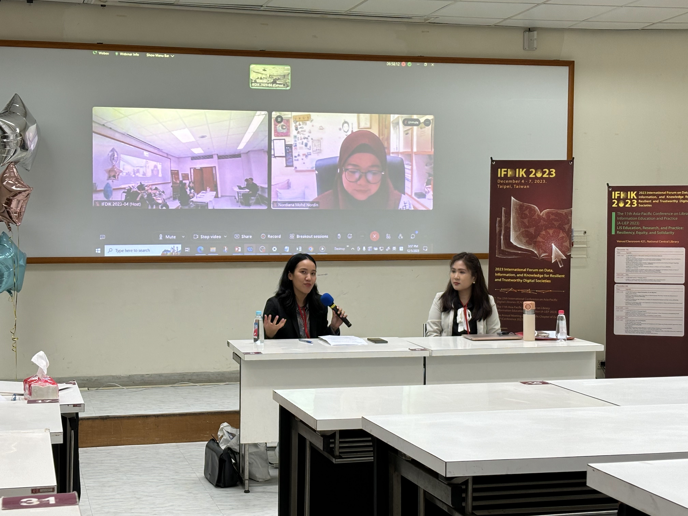
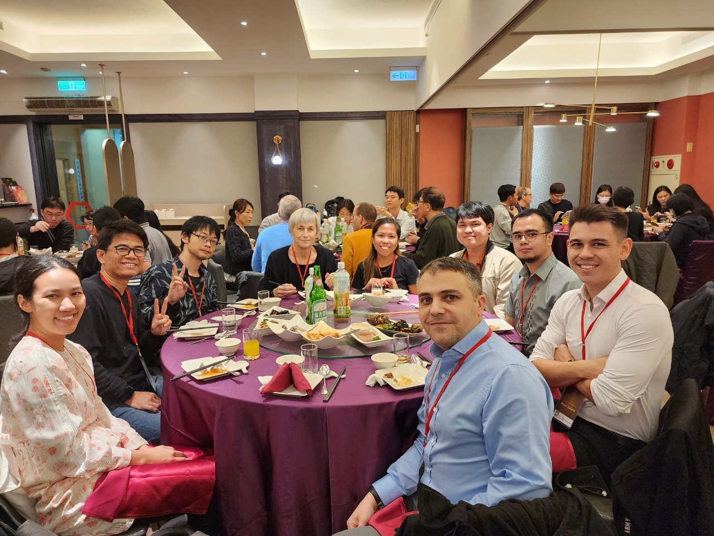
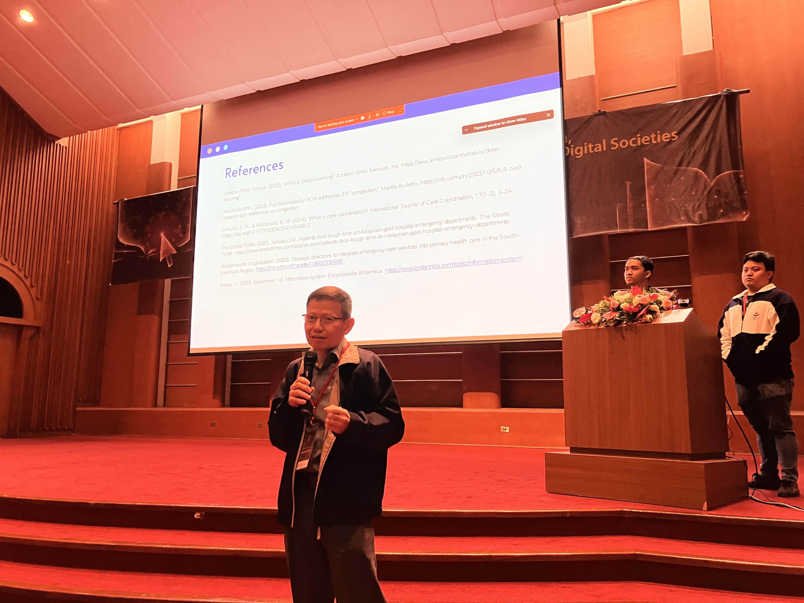

# A-LIEP 2023 in Taipei, Taiwan, R.O.C.

The 11th Asia Pacific Library and Information Education and Practice (A-LIEP) Conference was held on December 5-7, 2023 at the National Central Library, Taipei, Taiwan, R.O.C. The conference was co-located with the International Conference on Asia-Pacific Digital Libraries (ICADL) and the annual meeting of the Asia-Pacific chapter of iSchools (AP iSchools) under a collective title 2023 International Forum on Data, Information, and Knowledge for Resilient and Trustworthy Digital Societies. The conference focused on the challenges, opportunities, drivers and innovations in LIS education, research, and practice that were experienced and encountered by individuals and institutions to adapt and survive the recent pandemic and moving forward to the post-pandemic. The implementation of remote teaching and learning, application of alternative research methods, and dependency on online information services has brought about issues in inequalities of information access and use, injustices and abuses in creation and dissemination of information, misinformation, censorship, and control of the narrative by the powerful. On the other hand, new practices and processes have emerged and alternative research and teaching methods have been effected during these times that showed the resilience of the field, the educators, researchers and practitioners. The conference provides the venue for the discussion of such issues, realizations, and innovations in the context of information use, information professions, libraries, LIS education, and LIS research. The conference was an on-site, in-person event, but options to join and present online for those who cannot attend onsite were made available.

{:refdef: style=" max-width: 900px;   margin-left: auto; margin-right: auto;"}

{: refdef}

A total of 52 submissions were received and 30 papers were accepted with a 57.69% acceptance rate. From the accepted papers, 60 authors were from various countries including: Malaysia, Philippines, Japan, Pakistan, Taiwan, Singapore, Thailand, and Nigeria. The topics ranged from collaboration among libraries with other professions, community engagement, digital education, digital humanities, GLAMS, evidence-based librarianship, impact of LIS education to society, information literacy/digital literacy, service design and technology applications in LIS, and use of AI technologies in libraries among others.
{:refdef: style=" max-width: 900px;   margin-left: auto; margin-right: auto;"}

{: refdef}
The track on Education and Pedagogy, which was introduced in 2021, featured two panels.  One was on archives education and the other was on strengthening health literacy instruction in the LIS curriculum.  Both panels received engaging participation, eliciting critical reflection from the speakers and participants.

There were 10 sessions that featured the following topics:

* Organization of Data, Information, and Knowledge
* Information Seeking and Information Behavior
* Information Literacy, Digital Literacy, and Media Literacy
* Archival Education and Training in Southeast Asia
* Leadership Development and Strategic Management in Libraries
* Digital Humanities, Big Data, and AI
* Service Design and Design Thinking in Libraries
* Librarians and Consumer Health Education
* Information Institutions, Their Collections and Services
* LIS Pedagogies

{:refdef: style=" max-width: 900px;   margin-left: auto; margin-right: auto;"}

{: refdef}

<!-- ## Photos -->
<!--  -->
