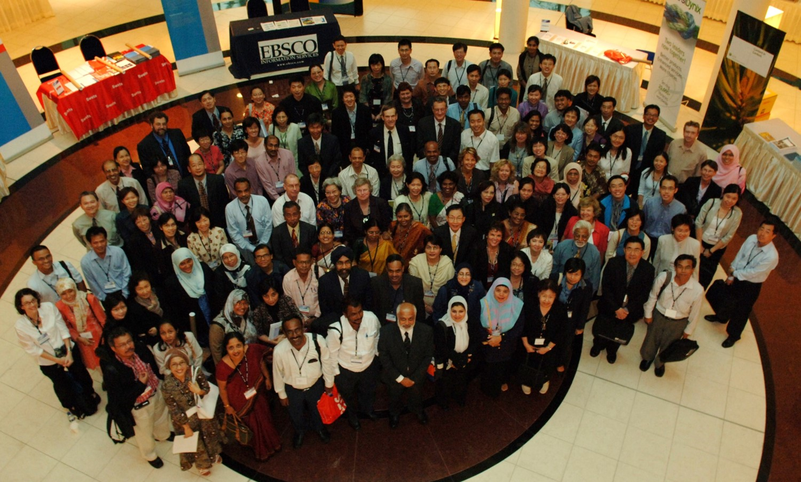

# Call for Papers for the A-LIEP 2025 Conference

The Asia-Pacific Library and Information Education and Practice (A-LIEP) Conference invites you to submit papers for the 2025 Conference to be held on December 3-5, 2025 hosted by the School of Library and Information Studies, University of the Philippines. This year’s conference is co-located with the International Conference on Asia-Pacific Digital Libraries (ICADL) and the annual meeting of the Asia-Pacific chapter of iSchools (AP iSchools) under a collective title “2025 International Forum on Data, Information, and Knowledge for Sustainable and Ethical Societies.”

{:refdef: style=" max-width: 900px;   margin-left: auto; margin-right: auto;"}

{: refdef}

The 12th A-LIEP conference theme is LIS Education, Research, and Practice: Ethics, Sustainability, and Social Responsibility. This conference aims to bring together practitioners, researchers, and LIS educators to explore and discuss how LIS education and practice in the Asia-Pacific region can contribute to building ethical and sustainable knowledge societies that foster equitable access, responsible information management, and community engagement.  We invite papers that discuss any of the following sub-themes: Exploring and addressing ethical issues in LIS education, research, and practice; Sustainability concerns and practices in library and archival services, including green libraries and digital preservation; Social responsibility and advocacy in LIS, including diversity, equity, and inclusion; Responsible data governance, open access, and digital rights; The role of LIS education in contributing to the attainment of the UN Sustainable Development Goals (SDGs); Decolonizing LIS curricula, LIS practices and knowledge practices; and AI, automation, and ethical considerations in LIS professions.

The conference is an in-person event and will be held at the University of the Philippines Bonifacio Global City Campus.

## Tracks and Integration Sessions
The conference will feature full and short research paper presentations on the following main topics/themes: LIS Education, LIS Practice, LIS Research. There will be two integration sessions and these are: a) Education and Pedagogy Panel  and b) Student Research Ideathon where students can discuss potential research projects, collaborate, and learn from one another.

The track on Education and Pedagogy, which was introduced in 2021, provides a venue for discussions relating to pedagogy, curriculum, tenure, promotion, and other matters relating to LIS educators and teaching.  We are inviting submissions of abstracts for discussion for a maximum of 3,000 words.
The Student Research Ideathon is a venue where students can participate and exchange ideas on how to draft research proposals and conduct research.  This can be an opportunity for students to get research collaborators, or suggestions for improvement of their proposals, or ideas for their future research.  We are inviting proposals from students/alumni who have already completed their research or students who currently are in the stages of drafting proposals to share their experiences, issues, roadblocks, best practices, etc.

## Submission and Formatting Guide
LIS professionals, educators, students, and researchers are invited to submit via [EasyChair](https://easychair.org/conferences/?conf=aliep2025) and be guided by the following:
* Full papers: maximum of 6,000 words
* Short papers: maximum of 4,000 words
* Education and pedagogy abstract: maximum of 3,000 words
* Student Research Ideathon abstract: maximum of 2,500 words

Papers should be written in English.  Please use the paper format indicated below (Times New Roman, pt 11, single space, APA citation style). The template is provided here: [Link to Template]().
Selected papers will be published in Scopus-indexed journals (such as LIBRES e-journal).

## Dates to Remember
- Submission deadline for all papers: July 14, 2025
- Acceptance Notification: September 8, 2025
- Camera-Ready Copy of Papers: October 1, 2025

# LIS Education
* LIS pedagogies
* Reading advisory
* Cooperative education
* Challenges in LIS education
* Collaboration among LIS schools/departments
* Curriculum design
* GLAM – Galleries, Libraries, Archives, and Museums
* Community engagement
* Digital education
* Quality assurance and accreditation of LIS programs
* Lifelong learning
* Impact of LIS education to society

# LIS Practice
* Technology application for LIS
* Service design and design thinking in libraries
* Digital and data curation, Digital preservation, Digital stewardship
* GLAM – Galleries, Libraries Archives, and Museums
* Relevance of libraries to society
* Leadership development and strategic management in libraries
* Libraries as a place: physical and virtual
* New competencies in LIS
* Evaluation in LIS
* Evidence-based librarianship
* Mobile platforms of libraries
* Collaboration among libraries and with other professions
* Use of AI Technologies in Libraries

## LIS Research
* Digital repositories
* Human Information Interaction
* Information literacy, Digital literacy, Data literacy, Media literacy
* Organization of Data, Information, and Knowledge
* Semantic web and linked data
* Knowledge management and knowledge services
* Text and data mining
* Digital humanities and digital cultural heritage
* Big Data and data science
* Information visualization
* Research evaluation in Science, Social Science, and Humanities
* Search as learning
* Gamification in libraries
* Digital scholarship

## Registration
Registration fees will be announced soon.  

## Organizing Committee Members
#### Conference Chair
Kathleen Lourdes B. Obille, School of Library and Information Studies, University of the Philippines, Diliman

#### Program Committee Co-Chairs
Maria Maura M. Tinao, School of Library and Information Studies, University of the Philippines, Diliman

Wei-Ning Cheng, Graduate Institute of Library and Information Studies, National Taiwan Normal University

#### Co-Chair, Education and Pedagogy Panel
Songphan Cheomprayong Department if Library and Information Science, Chulalongkorn University

#### Co-Chair, Student Research Ideathon
Christopher Khoo, Wee Kim Wee School of Information and Communication, Nanyang Technological University
