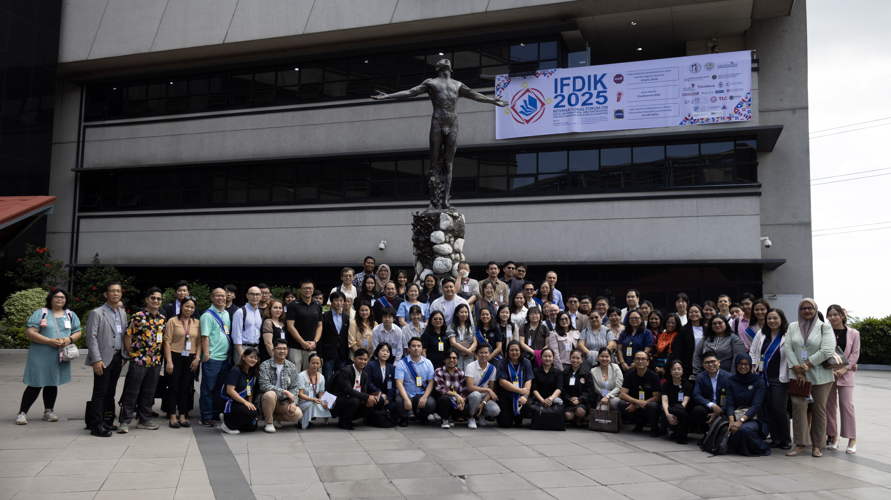
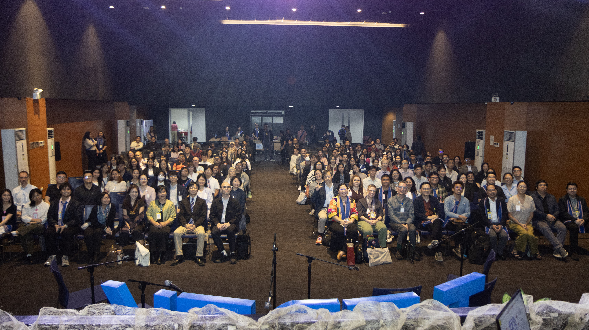
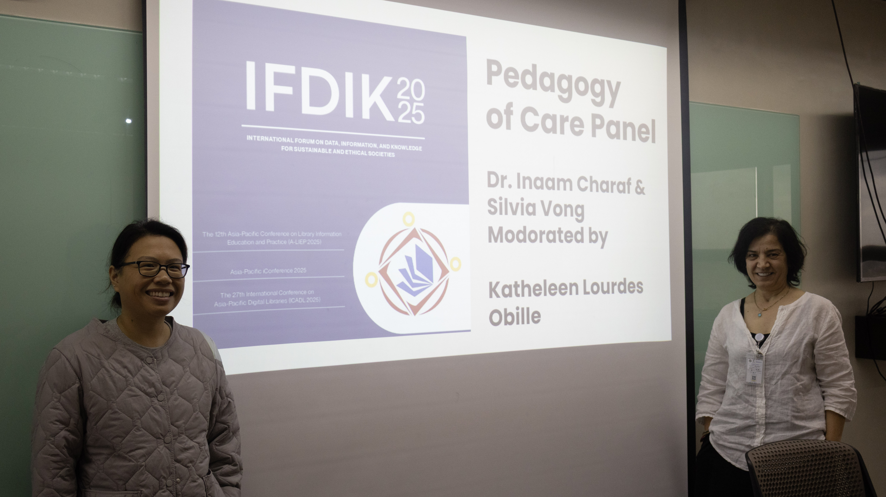

# 12th Asia-Pacific Library and Information Education and Practice Conference

The 12th A-LIEP Conference was held on December 3-5, 2025 at the University of the Philippines Bonifacio Global City Campus in Taguig, Manila, Philippines.  The conference is collocated with two other conferences: International Conference on Asia-Pacific Digital Libraries (ICADL) and Asia-Pacific Chapter of iSchools Conference (AP iConf), under the collective title 2025 International Forum on Data, Information and Knowledge for Sustainable and Ethical Societies. 
-insert image - 

{:refdef: style=" max-width: 900px;   margin-left: auto; margin-right: auto;"}

{: refdef}

The conference sought to bring together practitioners, researchers, and LIS educators to explore and discuss how LIS education and practice in the Asia-Pacific region can contribute to building ethical and sustainable knowledge societies that foster equitable access, responsible information management, and community engagement. The submitted papers centered on: Exploring and addressing ethical issues in LIS education, research, and practice; Sustainability concerns and practices in library and archival services, including green libraries and digital preservation; Social responsibility and advocacy in LIS, including diversity, equity, and inclusion; Responsible data governance, open access, and digital rights; The role of LIS education in contributing to the attainment of the UN Sustainable Development Goals (SDGs); Decolonizing LIS curricula, LIS practices and knowledge practices; and AI, automation, and ethical considerations in LIS professions. 

{:refdef: style=" max-width: 900px;   margin-left: auto; margin-right: auto;"}

{: refdef}

There were 80 submissions in total from 13 countries with 57% acceptance rating. Countries with the most number of submissions are Philippines, Japan, Taiwan, and Malaysia. There were 31 accepted papers from 65 authors from 7 countries - Philippines, Japan, Taiwan, Malaysia, United States of America, South Korea, and Thailand.  These accepted papers formed part of the 8 paper presentation sessions under the following themes: Bibliometrics and Academic Analytics; Libraries, Communities, and Memory; Information Behavior and Knowledge Practices in the Age of AI; LIS Education in Southeast Asia and East Asia; Information Organization and Retrieval; Media and Information Literacy; Design and Engagement in Library Practice; and Librarianship and Research. 

## Keynote Speakers

The Education and Pedagogy Panel, which was introduced in 2021 featured one panel titled An Ethical Approach to LIS Education: Pedagogies of Care in Course Assignments and Classroom Lessons with Inaam Charaf and Sylvia Vong as speakers. The panelists presented examples of how they engage with a pedagogy of care in LIS education. They showed specific teaching and learning strategies, and activities used to ensure that LIS students are cared for.  The panel encouraged discussions on how care can be a motivation for the design of teaching and learning activities in class.  The conversations also made the participants realize that they have either implemented ethics of care in their pedagogy without them realizing, and other participants realizing that they have experienced such in their classroom. The panelists also discussed the challenges of applying the principles of practice in a neoliberal and Western dominant setting. 

{:refdef: style=" max-width: 900px;   margin-left: auto; margin-right: auto;"}

{: refdef}

Two workshops were also hosted. The first workshop was on Publishing to Scholarly Journals facilitated by Brendan Luyt of Nanyang Technological University and Editor-in-Chief of LIBRES Journal. The second workshop was on Book Editing facilitated by Maha Kumaran of University of Saskatchewan and Beth McNeil of Purdue University. 

The Student Ideathon received a total of 12 submissions, the largest submission so far for this track.  There were two sessions for the ideathon with six presentations each.  The panel members for Session 1 include: Emily Drabinski, Iyra Buenrostro-Cabbab, and Wei-Ning Cheng. Session 2 panel members include: Antoine Doucet, Masao Takaku, Iyra Buenrostro – Cabbab, and Wei-Ning Cheng. 

{:refdef: style=" max-width: 900px;   margin-left: auto; margin-right: auto;"}
(assets/images/IA-LIEP 2025 Ideathon afternoon.jpg)
{: refdef}

## Organizing Committee Members
#### Conference Chair
Kathleen Lourdes B. Obille, School of Library and Information Studies, University of the Philippines, Diliman

#### Program Committee Co-Chairs
Maria Maura M. Tinao, School of Library and Information Studies, University of the Philippines, Diliman

Wei-Ning Cheng, Graduate Institute of Library and Information Studies, National Taiwan Normal University

#### Co-Chair, Education and Pedagogy Panel
Songphan Cheomprayong Department if Library and Information Science, Chulalongkorn University

#### Co-Chair, Student Research Ideathon
Christopher Khoo, Wee Kim Wee School of Information and Communication, Nanyang Technological University
